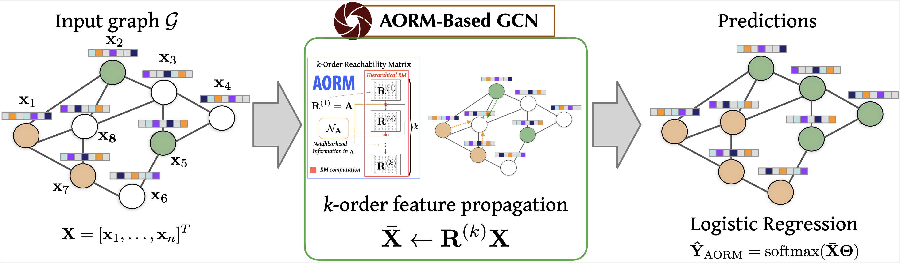

# Graph Convolutional Network using Incremental Reachability (GCNIR)

[](#python)
[](https://opensource.org/licenses/MIT) 


## Overview
This repository contains an example implementation of the Graph Convolutional Network using Incremental Reachability (GCNIR).



All experiments for two tasks (node classification task, and traffic prediction task) are run on a single computer using an Intel Xeon E5 3GHz processor and 64 GB RAM.
In this experiment, we train AORM-based GCN for 100 iterations with the Adam optimizer and a learning rate of 0.2, same as in [the previous work](https://github.com/pulkit1joshi/SGC).

## Dependencies
Our implementation works with PyTorch>=1.0.0.  

### Node Classification

Install other dependencies for testing the node classification.

```
$ cd node_classification
$ pip install -r requirement.txt
```

### Traffic Prediction

Install other dependencies for testing the traffic prediction.

```
$ cd traffic_prediction
$ pip install -r requirement.txt
```

## Data 
### Node Classification
We provide the citation network datasets under `data/`, which corresponds to [the public data splits](https://github.com/tkipf/gcn/tree/master/gcn/data).
Due to space limit, please download reddit dataset from [FastGCN](https://github.com/matenure/FastGCN/issues/9) and put `reddit_adj.npz`, `reddit.npz` under `data/`.

### Traffic Prediction
The following folder includes the dataset (Chunho dataset) for traffic prediction.
```
$ cd traffic_prediction/data/
```
You can find the dataset.

## Usage

### Node Classification

Citation Networks: We tune the only hyperparameter, weight decay, with hyperopt and put the resulting hyperparameter under `AORM-tuning`. 
See `tuning.py` for more details on hyperparameter optimization.

```
$ python citation.py --dataset cora --tuned --model AORM
$ python citation.py --dataset citeseer --tuned --epochs 150 --model AORM
$ python citation.py --dataset pubmed --tuned --model AORM
```

Reddit:
```
$ python reddit.py --inductive --test --model AORM
```

### Traffic Prediction

We exploit the [DCRNN model](https://github.com/tsinghua-fib-lab/Traffic-Benchmark/tree/master/methods/DCRNN) to implement the GCNIR for training performance evaluation.

```
$ python dcrnn_train_pytorch.py --config_filename=data/model/dcrnn_chunho_saorm.yaml
$ python dcrnn_train_pytorch.py --config_filename=data/model/dcrnn_chunho_laplacian.yaml
$ python dcrnn_train_pytorch.py --config_filename=data/model/dcrnn_chunho_random_walk.yaml
$ python dcrnn_train_pytorch.py --config_filename=data/model/dcrnn_chunho_dual-random_walk.yaml
```

### Acknowledgement
This repo is modified from [Sparse AORM](https://github.com/sungsoo/Sparse-AORM), [pygcn](https://github.com/tkipf/pygcn), [FastGCN](https://github.com/matenure/FastGCN), [Simple Graph Convolution](https://github.com/pulkit1joshi/SGC), and [Traffic Prediction Benchmark](https://github.com/tsinghua-fib-lab/Traffic-Benchmark).
